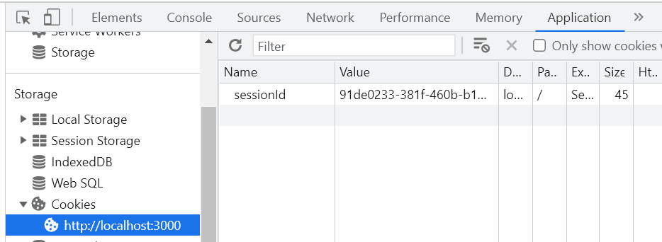
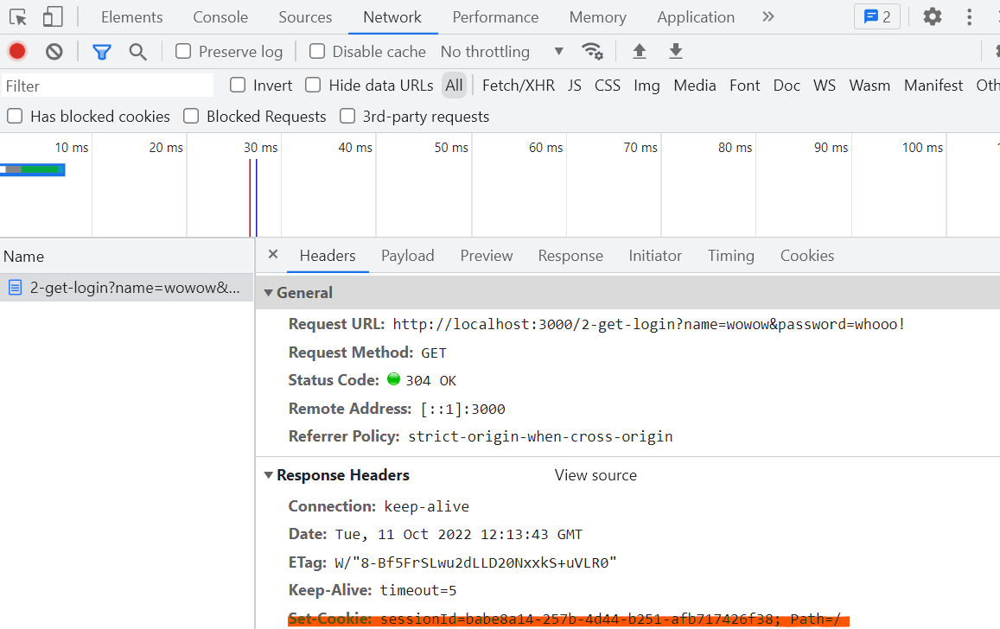

# ハンズオン１：CSRF を体験してみよう
環境構築が済んでいない人は、[このページ](../pre/environment-setting.html)に従って環境構築をしてください。

この章では、https://github.com/sasakiy84/csrf-demo を利用します。
readme に従ってアプリを起動してください。nodejs か docker-compose の実行環境が必要です。
読み進めていくと、localhost:3000 / 127.0.0.1:4000 へのリンクが出てくると思います。これは、サンプルアプリへのリンクを示しています。localhost:3000 のリンクが本物のアプリで、127.0.0.1:4000 のリンクが攻撃者が作成したアプリのものだと思ってください。

## もっとも単純な CSRF： GET リクエストで掲示板への投稿
まずは、ログイン認証がなく、GET を使ったエンドポイントを用いて、最も簡単な CSRF を示します。
なお、今後はローカルマシンでサンプルアプリが起動していることを前提として、実際に挙動を確認するリンクなどを示します。

### シナリオとコード
以下、理解を助けるために、現実に当てはめたシナリオを提示します。

> あなたは、掲示板サイトを作ることにしました。
> 機能としては以下の通りです。

> ユーザーはログイン認証が不要
> ユーザーの識別は IP アドレスで行う
> 投稿内容は、URL のクエリパラメタとしてクライアントからサーバーに送信される
> 投稿された内容は、すべて同じ掲示板で表示され、だれでも閲覧できる
> CSRF の脆弱性を抜きにしても色々と問題がありますが、あなたは経験不足から問題点に気が付きませんでした。

その結果として実装されたのが、以下のエンドポイントです。
なお、本質でない機能は簡略化しています。たとえば、投稿された内容は保存などを行っていません。
https://github.com/sasakiy84/csrf-demo/blob/main/originHandler/1-board.ts

```js
// /1-get-board に来た GET リクエストを処理する
router.get("/1-get-board", (req, res) => {
  // リクエスト送信者の IP アドレスを取得する
  const ip = req.ip;
  // URL クエリパラメタに text という名前で埋め込まれている値を取得する
  const postedText = req.query.text;
  if (!postedText) {
    res.send("query: text is required");
    return;
  }
  // 掲示板に投稿する代わりに、サーバー側のコンソールに表示する
  console.log(`user: ${ip} ::: ${postedText}`);
  res.send(`<p>全体掲示板：今日の投稿<br />user: ${ip} ::: ${postedText}</p>`);
});
```

簡単に処理の内容を説明すると、reqest の情報が入っているreqという変数から IP アドレスと text という URL のクエリパラメタを取り出して、その内容を表示させています。

クエリパラメタについて概要を説明しておきます。
URL は、いくつかの部分に分けることができ、クエリパラメタは path の後の部分をさします。具体的には、?で始まり、以降key1=value1の組み合わせが&で繋がっていきます。
たとえば、http://example.com/path/to/html.html?key1=value1&key2=value2のような感じです。
検索クエリなどをクライアントがサーバーに渡すときに用いられることが多いです。

### アプリの正常系
サーバーは、クライアントから以下のような URL のリクエストを受け取ります。
```
http://localhost:3000/1-get-board?text=%E3%81%AF%E3%81%98%E3%82%81%E3%81%A6%E3%81%AE%E6%8A%95%E7%A8%BF
```

ここでのクエリパラメタは、text=%E3%81%AF%E3%81%98%E3%82%81%E3%81%A6%E3%81%AE%E6%8A%95%E7%A8%BFの部分です。
ちなみに、%E3などの意味不明な文字列は、日本語が変換されたものです。ブラウザの検索窓などにコピペすると、日本語が復元されると思います。

このリンクにアクセスすると、処理が実行され、今回であればはじめての投稿という投稿内容がコンソール画面とクライアントに表示されます。

### 攻撃シナリオ

では、このアプリにどのような CSRF 脆弱性があるのでしょうか。あるシナリオを想定してみましょう


> あなたがとあるブログを見ていると、以下のようなコメントがありました。

> > この記事について、より詳細に書かれた内容が >> [ここ](http://localhost:3000/1-get-board?text=%E7%A7%81%E3%81%AF%E5%91%BC%E5%A3%B0%E5%B8%82%E5%BD%B9%E6%89%80%E3%82%92%E7%88%86%E7%A0%B4%E3%81%97%E3%81%BE%E3%81%99) << にあります

> あなたが興味をもってこのリンクを踏むと、以下の URL にとばされます

> http://localhost:3000/1-get-board?text=%E7%A7%81%E3%81%AF%E5%91%BC%E5%A3%B0%E5%B8%82%E5%BD%B9%E6%89%80%E3%82%92%E7%88%86%E7%A0%B4%E3%81%97%E3%81%BE%E3%81%99

> すると、なんと匿名掲示板サイトに以下の内容が投稿されました

> > 私は呼声市役所を爆破します

> この投稿は警察に通報され、IP アドレスをもとに投稿者が捜索されました。


ここで、再び CWE の定義を確認してみましょう。

英語版

> The web application does not, or can not, sufficiently verify whether a well-formed, valid, consistent request was intentionally provided by the user who submitted the request.
> https://jvndb.jvn.jp/ja/cwe/CWE-352.html

日本語版

> 本脆弱性が存在する Web アプリケーションは、フォーマットに沿った、妥当で一貫性のあるリクエストが、送信したユーザの意図通りに渡されたものかを十分に検証しない、あるいは検証が不可能です。
> https://cwe.mitre.org/data/definitions/352.html

今回の爆破予告を投稿したリクエストは、ユーザーが意図していないリクエストです。ユーザーはリンクをクリックした時点で、爆破予告を投稿しようという意図は一切なかったはずです。
にもかかわらず、サーバー側ではこのリクエストを正規のものとみなして、掲示板に投稿するという処理を実行してしまいました。このように、ユーザーが意図していないリクエストにより、サーバー側の処理が実行されてしまうのが CSRF 脆弱性です。

演習として、クエリパラメタを調整して、不適切投稿をユーザーにさせてみてください。


## ログイン機能をつけても？
前節では、リンクをクリックするだけで、容易に CSRF 攻撃をされてしまうことを説明しました。
では、例えばログイン認証などの機能を入れれば問題なかったのでしょうか？

この節では、一般的にログイン認証として使われている cookie を使った認証機構を、GET リクエストを使って実装します。そして、GET リクエストを使っているとログイン認証があっても、依然として CSRF 脆弱性があることを説明します。

### cookie とはなにか

> サーバーがユーザーのウェブブラウザーに送信する小さなデータであり、ブラウザーに保存され、その後のリクエストと共に同じサーバーへ返送されます。一般的には、 2 つのリクエストが同じブラウザーから送信されたものであるかを知るために使用されます。
> https://developer.mozilla.org/ja/docs/Web/HTTP/Cookies

cookie は、HTTP ヘッダの一種です。
サーバーからクライアントにレスポンスを返すときに、サーバー側のアプリケーションは必要に応じて、Set-Cookieヘッダをレスポンスに付与します。

Set-Cookieヘッダを含むレスポンスを受け取ったクライアント（基本的にはブラウザ）は、クライアント側の端末に cookie を保存します。cookie は、name=value という形式をもち、文字列として保存されます。

### cookie を使ったセッションの実装

### サンプルアプリの正常系の挙動確認

まずは、以下の URL にアクセスして、login requiredという表示がされることを確認してください

http://localhost:3000/2-get-confirm

次に以下のリンクにアクセスすると、logined!という表示が出ると思います。以下のリンクには、name と password というクエリパラメタが含まれています。

http://localhost:3000/2-get-login?name=wowow&password=whooo!

その後、再度以下のリンクにアクセスしてみると、ログインしていることが確認できると思います

http://localhost:3000/2-get-confirm

### サンプルアプリの正常系のコード確認

実装をみながら説明していきます。
/2-get-confirm の URL にアクセスすると、/originHandler/2-password-change.tsファイルの 8 行目にある、以下のような処理が開始されます。

```js
// /2-get-login に GET リクエストがきたら、この関数が処理を受け持つ
router.get("/2-get-login", (req, res) => {
  // name, password の値を URL クエリから取り出す
  const { name, password } = req.query;
  // name, password が存在するかを確かめる
  if (typeof name !== "string" || typeof password !== "string") {
    res.send("query: name and password is required");
    return;
  }

  // 正しい name と password かどうかを検証する
  if (users[name] && users[name].password === password) {
    // ランダムな sessionId を生成する
    const sessionId = crypto.randomUUID();
    // sessionId をサーバー側に保存する
    sessionIds[sessionId] = {
      userName: name,
    };
    console.log(`registered sessionId ${sessionId} for user ${name}`);
    // sessionId をクライアントに保存するために、 Set-Cookie ヘッダを追加する
    res.cookie("sessionId", sessionId);
    // レスポンスを返す
    res.send("logined!");
  } else {
    res.send("name or password is incorrect");
  }
});
```
また、usersオブジェクトは、以下のようなデータで初期化されています

```js
const users: Users = {
  wowow: {
    password: "whooo!",
  },
};
```

上記の処理が行われた結果、あなたのクライアントに sessionId の cookie が保存されます。実際に保存されたかどうかを見てみましょう。
以下、chrome で cookie を確認します。
logined!が出ている画面で検証ツールを開いてください（右クリックのメニューから「検証」をクリックしてください）
次に、application タブを開き、cookie から、localhost:3000 を選択してください。すると、sessionIdの欄に、生成された sessionId が確認できるでしょう。



そのまま、検証画面上で network タブを開いてください。
そして、以下のページを再読み込みすると、ネットワークでやりとりされているファイルがみられると思います。

http://localhost:3000/2-get-login?name=wowow&password=whooo!

その中から document の 2-get-login を開いてみましょう。request と response のそれぞれの HTTP ヘッダが確認できると思います。response のなかに、Set-Cookieヘッダがあることを確認しましょう。



また、以下のリンクを踏むと、request に Cookieヘッダが含まれていることが、同様に network タブから確認できます。

http://localhost:3000//2-get-confirm


### パスワード変更機能
ログインした状態で、以下のリンクにアクセスすると、パスワード変更が可能です。クエリパラメタのnewPasswordの値を好きなものに書き換えてください。
http://localhost:3000/2-get-password-change?newPassword=yourNewPassword

ログインした状態であれば、changePassword関数が実行され、パスワードが変更されるはずです。

実装を確認してみましょう。

```js
// 2-get-password-change というパスに GET リクエストがきたら処理する
router.get("/2-get-password-change", (req, res) => {
  // cookie から sessionId を取り出す
  const sessionId = req.cookies["sessionId"];
  // クエリパラメタから newPassword を取り出す
  const newPassword = req.query.newPassword;

  // sessionId を確認し、ログイン済みかどうかを確かめる
  if (!sessionId || !sessionIds[sessionId]) res.send("login required");
  // passward を変更する
  else if (typeof newPassword !== "string") res.send("newPassword is required");
  else {
    const userName = sessionIds[sessionId].userName;
    changePassword(userName, newPassword);
    res.send("password changed!");
  }
});
```

### CSRF を試してみる
以上のような実装をしている場合の CSRF 脆弱性について確認します。
ある日、以下のようなメールが送られてきて、リンクをクリックしたとします。

> おめでとうございます！抽選に当選しました！！以下のリンクから景品を選んでください！！！！
> [当選品選択ページ](http://localhost:3000/2-get-password-change?newPassword=evilPassword)

このとき、ログインした状態であれば、localhost:3000 に sessionId を含んだ cookie が送信されます。すると、サーバー側は既にログイン済みとして、パスワード変更の処理を実行してしまい、あなたのアカウントのパスポートがevilPasswordに変更されてしまいます。

今回であれば、リンクは次のようなものだったので、パスワードが evilPassward になってしまうということですね。
http://localhost:3000/2-get-password-change?newPassword=evilPassword

ほかにも、たとえば掲示板サービスの投稿用 API のリンクであれば、不適切な発現を投稿してしまうかもしれません。

このような挙動は、cookie が送信される条件に注目すると理解できます。
cookie を送信するかどうかは、cookie を発行したドメインであれば自動で送信することになっています。逆に言えば、送信元がどのウェブサイトであっても（攻撃者のウェブサイトであっても、悪意のあるリンクによる遷移だとしても）、送信先が一致すれば cookie は送られるということです。
この挙動は、ユーザーの利便性のためには欠かせないものです。もしドメインをまたいだリクエストのときに cookie が送信されないと、ほかページのリンクから遷移するごとに毎回認証が必要になってしまいます。
たとえば、もし twitter へのリンクがこのウェブサイト上にあったとして、リンクをクリックすると twitter の画面にログイン済みの状態で遷移することを期待すると思います。ログイン済みの状態でなければ、いいねなどができないですしね。しかし、異なるドメインのサイトなので、cookie が送信されず、ログイン状態にならないといった事態が起こるでしょう。（これは twitter が cookie でログイン状態を管理していた
場合の話です）

今回であれば、localhost:3000 に紐づけられている cookie が存在したので、localhost:3000 宛てのリクエストを送るときにその cookie を含んだリクエストを作ったということです。

ただし、以上の説明は現在ではウソがあります。後でそこのことを説明します。

## 
