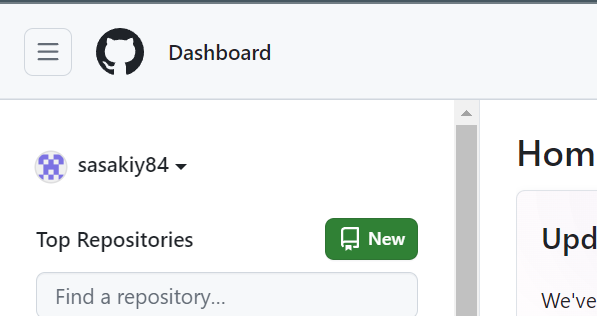
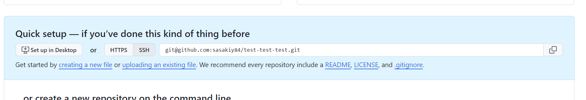

# GitHub Actions を使う準備をする
この節では、講義当日に GitHub Actions を使う準備をします。
具体的には、GitHub のリポジトリにコードをアップロードします。

アップロードするコードは、HTML が生成できるものであればなんでもいいです。しかし、せっかくなので Honkit というライブラリを使います。Honkit のような HTML 生成ライブラリを利用してみることで、自分でウェブサイトをホスティングするときにやりやすくなるはずです。

## GitHub のアカウントを作る
GitHub のアカウントを持っていない人は、[GitHub でのアカウントの作成 - GitHub Docs](https://docs.github.com/ja/get-started/start-your-journey/creating-an-account-on-github)を参考にしながら、アカウントを作成してください。

## Honkit
ウェブサイトを公開するには、以下の三つが必要です。

- 表示するコンテンツ（たとえば HTML）
- サーバー（コンテンツを置いておく場所）
- ドメイン（サーバーの住所）

このうち、サーバーとドメインは GitHub が提供してくれるものを利用します。
コンテンツについては、これから Honkit と呼ばれる Node エコシステムのライブラリを使って作成します。

[About this documentation · HonKit Documentation](https://honkit.netlify.app/)

Honkit は、形の整ったきれいなサイトを簡単に作れるライブラリです。
このドキュメントも Honkit を使って作成されています。

まずは、今回作業するディレクトリを作成しましょう。
コマンドラインか、ファイル操作ツール（Explorer や Finder）を使って、好きな場所に `seccamp-tokyo-a-1-honkit`というフォルダを作成してください。フォルダ名が異なっても構いません。

その後、コマンドライン上でそのディレクトリまで移動し、以下のコマンドを打ってください。
```sh
npm init -y
npm install honkit
git init
npx honkit init
```

すると、`.git`フォルダや`package.json`、`README.md`や`_SUMMARY.md`などのファイルが作成されたと思います。

npm は、 node で使えるパッケージの管理ツールです。npm コマンドを使って、ほしいパッケージをインストールできます。
git は、ソースコードのバージョン管理ツールです。このドキュメントでは深い理解は必要ないので、「ソースコードを管理してくれる君」と思っておいてください。
npx は、node のエコシステムにあるライブラリを使用するためのコマンドで、今回は Honkit のライブラリを使ってディレクトリを初期化しています。これにより、Honkit のためのファイルが作成されます。

これらのコマンドは、現在のフォルダを 「npm / git で管理します」という設定を行うコマンドです。

次に、`.gitignore`ファイルを作成し、以下の内容をコピペしてください。
```
node_modules/
_book/
```

最後に、以下のコマンドを打って、Honkit を起動してみましょう。
```sh
npx honkit serve
```

すると、以下のリンクで Honkit のページが見れるようになったと思います。
`README.md`を編集するとブラウザでもコンテンツが変わるはずです。

## GitHub にプッシュする
これまでにできたものを GitHub にアップロードしましょう。

大まかに以下のような手順で進めます。

1. 自分の端末から GitHub に通信ができるようにする
2. GitHub に空のリポジトリを作成する
3. 現在のコードを 2 で作った空のリポジトリにアップロードする


### 自分の端末から GitHub に通信ができるようにする
まずは、GitHub にコマンドラインからアクセスできるようにしましょう。
以下の公式ページを参考に、GitHub の認証情報を登録してください。
https://docs.github.com/ja/get-started/getting-started-with-git/set-up-git#git-%E3%81%8B%E3%82%89-github-%E3%81%A7%E8%AA%8D%E8%A8%BC%E3%81%99%E3%82%8B

HTTPS と SSH の二つの接続方法がありますが、どちらでも構いません。
[HTTPS による認証を GitHub CLI を用いて行う](https://docs.github.com/ja/get-started/getting-started-with-git/caching-your-github-credentials-in-git#github-cli)のが楽だと思います。


### GitHub に空のリポジトリを作成する
GitHub のサイトに行って、ログインしてください。
左上にある、New のボタンを押すと、新しいリポジトリが作成できます。


Owner が自分であることを確認し、リポジトリの名前を`seccamp2024-tokyo-a-1`などとしてください。リポジトリの名前は好きなもので大丈夫です。
外部に公開したくない人は Private を選んでください。

その他の場所には触らずに、`Create Repository`ボタンを押しましょう。すると、空のリポジトリが作成されます。

### 現在のコードを 2 で作った空のリポジトリにアップロードする
空のリポジトリができたら、そこにコードをアップロードします。
Honkit の作業をしたフォルダ内で、以下のコマンドを順番に打ってください。

```sh
git add .
git commit -m "first commit"
```

つぎに、以下のコマンドの REPOSITORY_LINK を GitHub の画面上のものに置き換えて実行してください。



ただし、「自分の端末から GitHub に通信ができるようにする」で SSH 認証を選んだ人は SSH を選んだ時にでてくる文字列を、HTTPS 認証を選んだ人は、 HTTPS を選んだときに出てくる文字列で置き換えてください。

```sh
git remote add origin REPOSITORY_LINK
```

SSH 認証の人は`git remote add origin git@github.com:sasakiy84/test-test-test.git`、HTTPS 認証の人は`git remote add origin https://github.com/sasakiy84/test-test-test.git`のようになると思います。

最後に以下のコマンドを打って、コードをアップロードしましょう。このコマンドを実行した後に、空のリポジトリをリロードすると、コードがアップロードされているはずです。
```sh
git push -u origin master
```

もし、「username と email を設定してください」という旨のエラーが出たら、以下のコマンドで設定しましょう。
```sh
git config --global user.name "あなたの名前"
git config --global user.email "あなたのメールアドレス"
```

以下のリポジトリのようになっていれば OK です。

https://github.com/sasakiy84/seccamp-2024-tokyo-honkit