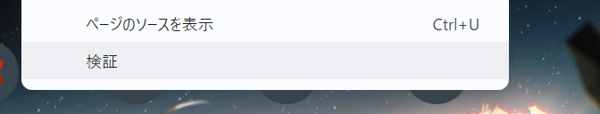
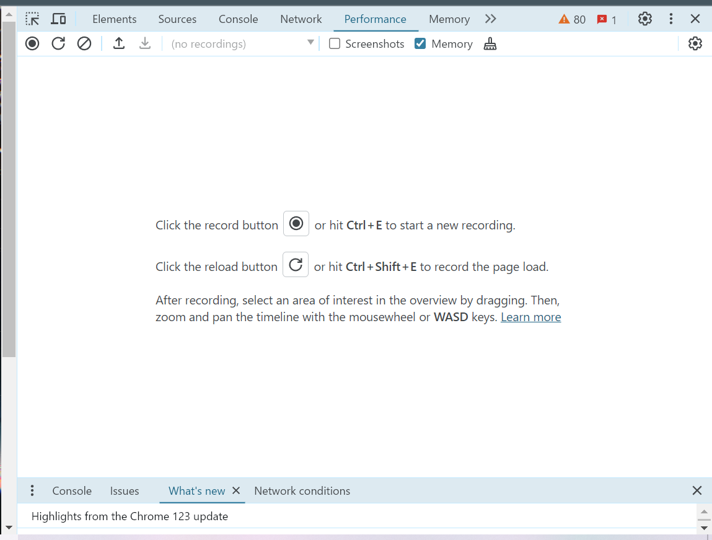
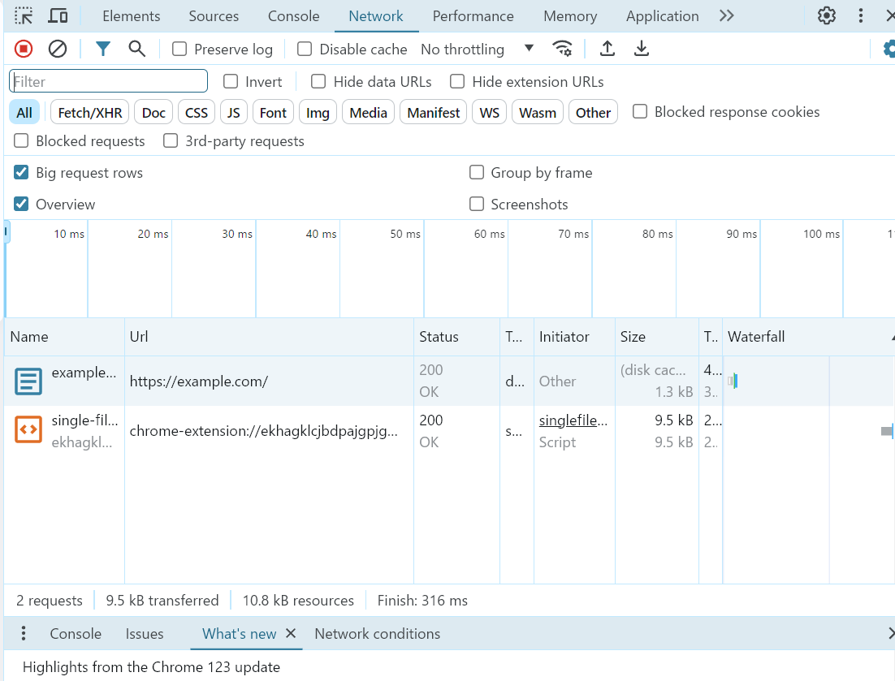
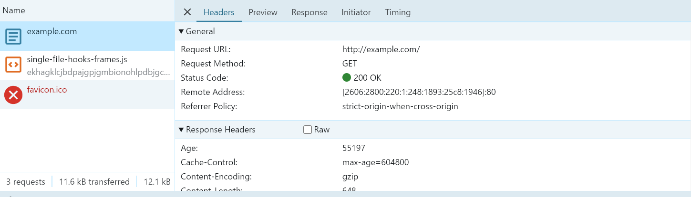
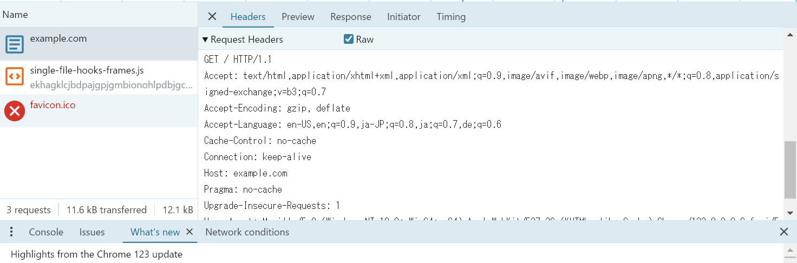

# HTTP による通信を触ってみる

## HTTP とは

HTTP(Hypertext Transfer Protocol) は、サーバーとクライアントが通信するためのプロトコルです。
クライアントとは、主に Chrome, Firefox, Safari, Edge などのウェブブラウザのことを指します。
サーバーとは、コンテンツを供給するもの（server）で、HTTP 通信を受け入れるコンピューターのことを指します。
プロトコルとは、やりとりの方法を定めたルール集のことです。たとえば、「通信の一単語目には、別に定められた特定の単語しか使ってはいけない」などです。

まとめると、HTTP とは、「コンテンツを供給するもの（server）で、HTTP 通信を受け入れるコンピューターであるサーバーと、主に Chrome, Firefox, Safari, Edge などのウェブブラウザなどのクライアントが通信するための、やりとりの方法を定めたルール集」です。

私たちが普段 Web (World Wide Web) と呼んでいるものは、この HTTP を使ってリソースのやり取りをしていることが多いです。

## コマンドラインでウェブサイトを取得してみよう
curl コマンドを使ってウェブサイトを取得してみます。
以下のコマンドを打ってみてください。

```sh
curl http://example.com
```

すると、`<!doctype html>`から始まる結果が HTML 文書が出力されたと思います。
これは、curl コマンドを使って、http://example.com という URL にリクエストを送り、その結果として HTML 文書を得ています。
実際にブラウザで http://example.com にアクセスしたときの画面と見比べてみると、`This domain is for use in illustrative examples in documents.`などの同じ文字列が見つかると思います。

もう少し詳しく見てみましょう。
curl には、verbose オプション（`-v`）があります。

```sh
curl -v http://example.com
```

すると、HTML の出力の前に、以下のような文字列が出力されたと思います。
```
*   Trying 93.184.216.34:80...
* Connected to example.com (93.184.216.34) port 80 (#0)
> GET / HTTP/1.1
> Host: example.com
> User-Agent: curl/7.81.0
> Accept: */*
>
* Mark bundle as not supporting multiuse
< HTTP/1.1 200 OK
< Accept-Ranges: bytes
< Age: 7831
< Cache-Control: max-age=604800
< Content-Type: text/html; charset=UTF-8
< Date: Mon, 01 Apr 2024 12:11:11 GMT
< Etag: "3147526947"
< Expires: Mon, 08 Apr 2024 12:11:11 GMT
< Last-Modified: Thu, 17 Oct 2019 07:18:26 GMT
< Server: ECS (sed/5889)
< Vary: Accept-Encoding
< X-Cache: HIT
< Content-Length: 1256
<
```

このうち、`>`が行頭についている行は、手元の端末からサーバーに送られた HTTP リクエストの一部です。
`<`が行頭にある行は、サーバーから送られてきた HTTP レスポンスの一部です。

HTTP メッセージの読み方は、[HTTP メッセージ | MDN](https://developer.mozilla.org/ja/docs/Web/HTTP/Overview#http_%E3%83%A1%E3%83%83%E3%82%BB%E3%83%BC%E3%82%B8)を参考にしてください。

さしあたり、以下の三点をわかっておいてほしいです。

- HTTP メッセージは書き方が決められている
- HTTP リクエストには、メソッドと呼ばれる部分がある
- HTTP リクエストとレスポンスには、ヘッダーと呼ばれる部分がある

## HTTP をしゃべってみよう
telnet を使って、HTTP をしゃべってみます。
ターミナルを開き、以下のように入力してください。

```sh
$ telnet example.com 80
```

すると、telnet の対話モードに入ります。
以下の HTTP リクエストをコピーしてはりつけてみるか、手で入力してみてください。

```http
GET / HTTP/1.1
Host: example.com
User-Agent: curl/7.81.0
Accept: */*
```

そして、改行を二回入力すると、HTML レスポンスが返ってくると思います。


## ブラウザが送っているリクエストを見てみよう
ブラウザには検証画面と呼ばれる、内部の挙動をある程度まで確認できるツールがあります。
検証画面を使って、ブラウザがどのようにウェブサイトのデータを取得しているのかを見てみましょう。

以降では、Google Chrome を想定して話を進めますが、他の主要なブラウザでも同じことはできます。
お使いのブラウザの検証画面の見方は、各自で調べてください。

### 検証画面を開く
ブラウザ上で右クリックするとポップアップでメニューが開きます。
その中から、「検証」という画面を選んでください。


すると、以下のような画面が開きます。上側に、Element, Sources, Console などの文字が表示されていれば大丈夫です。設定次第で、英語以外の項目名で表示されているかもしれません。


### 検証画面でリクエストを見る
検証画面を開いているタブの URL バーに、次の URL を入力して、エンターキーを押してください。

https://example.com/

その後、検証画面のネットワークタブを選択してください。
すると、以下のような画面になっていると思います。



中段あたりに表示されている項目が、一つ一つの HTTP リクエストを表します。
表示された項目の中の、 Name が example.com、 Type が document となっている列をクリックしてください。
すると詳細画面が開き、Headers のタブでどのようなヘッダーが送られ、どのようなヘッダーが返されているかが確認できます。



curl や telnet で送ったリクエストに含まれていたヘッダーと見比べて、同じものや異なるものを見つけてみましょう。

Raw option が表示されている人は、それを有効にすると、普通のテキスト形式でリクエスト・レスポンスを確認できます。
ただ、手元で確認したときに、同じ Chrome のバージョンでも表示される場合とされない場合がありました。出現条件が分かっていないので、知っている人がいたら教えてください。


## まとめ
クライアントとサーバーの通信方式を規定している HTTP について、実際に自分でリクエストを作って送ってみたり、ブラウザから送られるリクエストを観察しました。
HTTP メッセージでどのようなデータが送られているのかがイメージできるようになっていればと思います。

## 確認課題
理解度を確かめるための問題です。

### HTTP メソッド
`curl http://example.com`で送られる HTTP リクエストのメソッドはなんでしょうか？

### Headers
telnet で example.com にリクエストを送った時に、最低限必要なヘッダーはどれでしょうか？（1つかもしれませんし、複数あるかもしれません）
HTTP リクエストをいろいろと編集して、試してみてください。

このように、HTTP メッセージを手でいじることで、ブラウザの中で行われているクライアントとサーバーのやりとりの感覚をつかんでもらえればと思います。

### 検証画面
example.com 以外のサイトでも検証画面を開いて通信を確認してみましょう。
たとえば Type が document のもの以外に、どのようなファイルがやりとりされていますか？
また、GET メソッド以外のリクエストが送られているサイトはありますか？
